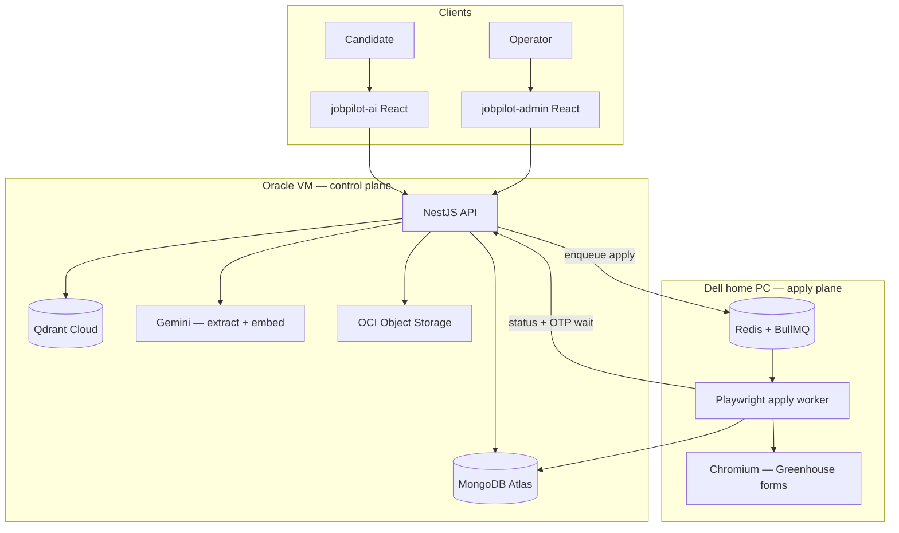
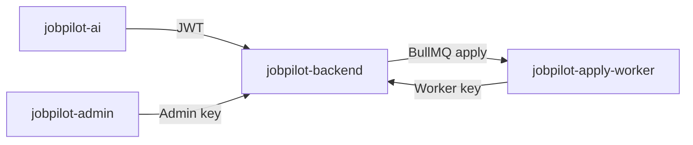

# Building JobPilot AI

Job hunting is repetitive: upload a résumé, skim listings, decide fit, fill the same forms again. Most tools either dump job links or blast applications with no judgment.

**JobPilot AI** is the system I built to do the middle work seriously — extract a profile from a résumé, match roles with vectors + rules, let the user accept, then automate the application on a separate worker machine with human-in-the-loop where the ATS demands it.

It spans **four repositories**: a NestJS API, a user React app, an admin catalog app, and a Playwright apply worker.

---

## The problem I set out to solve

Without a system like this:

- Matching is keyword search or gut feel
- Applying means retyping the same profile into Greenhouse/Lever every time
- “Auto-apply” bots are brittle and hard to operate safely
- AI extract + search + browser automation rarely live in one coherent pipeline

I wanted one product path:

- Understand the candidate from a PDF
- Rank jobs that actually fit
- Queue accepted roles for automation
- Fill ATS forms on a dedicated worker
- Keep approvals and OTP handling under operator control

---

## What I built

| Stage | What happens |
| --- | --- |
| **Résumé intelligence** | PDF upload → Gemini extracts a structured profile → user confirms |
| **Embeddings** | Profile + jobs go into Qdrant (768-d Gemini embeddings) |
| **Matching** | Vector search + scoring (embedding, experience, skills) |
| **Accept** | User accepts a suggestion; readiness checks missing apply fields |
| **Auto-apply** | BullMQ job on a Dell worker; Playwright drives Greenhouse (and open-URL fallback) |
| **OTP when needed** | Telegram bot delivers Greenhouse security codes to the worker |

Two React frontends sit on top: **JobPilot AI** for candidates, **JobPilot Admin** for job catalog, ingest sources, and queue visibility.

---

## End-to-end architecture

**How to read it:**

1. **Candidate app** — auth, résumé, matches, accept/reject, apply profile, and Telegram link.
2. **API on Oracle** — business logic, Gemini, Qdrant, Mongo, and job enqueue.
3. **Admin app** — seed and sync jobs from Greenhouse, Lever, and Ashby; manage the catalog and queues.
4. **Dell worker** — consumes the apply queue from Redis (Oracle reaches it over Tailscale), runs Playwright, and updates apply status.
5. **Split by risk** — browser automation stays off the public API host.

That’s the system: four repos, two machines, one apply queue.

---

## The four repositories

| Repo | Role |
| --- | --- |
| **jobpilot-backend** | NestJS modular monolith — auth, résumés, matching, ingest, Telegram bot, BullMQ producer |
| **jobpilot-ai** | Candidate SPA — real API for core flows; some marketing/insights UI still demo |
| **jobpilot-admin** | Internal ops — jobs, sources, sync, Bull Board |
| **jobpilot-apply-worker** | BullMQ consumer + Playwright on the Dell |

---

## Dual-machine production setup

| Machine | Runs |
| --- | --- |
| **Oracle VM** | Nest API behind Nginx Proxy Manager, PM2, Tailscale client |
| **Dell (home)** | Redis, Playwright worker, Chromium, optional self-hosted GitHub runner |

CI deploys the API to Oracle over SSH/PM2. The apply worker deploys to the Dell self-hosted runner. Redis is shared so the cloud API can enqueue and the home worker can consume without exposing Playwright to the public internet.

---

## Hard engineering problems I solved

**Hybrid matching, not “cosine only”**  
Qdrant finds neighbors; a scoring layer blends embedding similarity with experience and skills so rankings feel usable, not just nearest-neighbor noise.

**Producer / consumer split across networks**  
The API never runs headless Chrome. It enqueues; the Dell worker applies. Redis over Tailscale keeps that bridge private.

**ATS automation with guardrails**  
Greenhouse fill is real (resume upload, fields). Submit can stay off by default (`APPLY_SUBMIT`) so dry-runs don’t spam employers while the pipeline is tuned.

**OTP without putting Telegram in the critical UI path**  
The Nest API hosts the Telegram bot; the worker long-polls for security codes during Greenhouse flows. Job accept/reject stays in the web app — Telegram is for codes, not match approvals.

**Three auth planes**  
JWT for users, admin API key for ops, worker secret for internal apply endpoints — so a leaked frontend token can’t drive the Playwright machine.

**Apply readiness gates**  
Accepting a job checks missing profile fields before enqueue, so the worker fails less often on empty forms.

---

## Tech I used

| Area | Stack |
| --- | --- |
| API | NestJS, TypeScript, MongoDB, Redis, BullMQ |
| AI / search | Gemini (extract + embeddings), Qdrant |
| Frontends | React, Vite, TypeScript, TanStack Query, Zustand |
| Automation | Playwright, PM2 on Dell |
| Infra | Oracle Cloud VM, Nginx Proxy Manager, OCI Object Storage, Tailscale, GitHub Actions, Cloudflare Pages |

---

## Outcomes — what I achieved

- Shipped a **multi-repo product** (API, candidate app, admin, apply worker) — not a single demo script
- Combined **LLM résumé extraction**, **Qdrant vector matching**, and **Playwright auto-apply** into one candidate journey
- Split **control plane** (Oracle NestJS API) from **automation plane** (Dell Playwright worker) over a shared BullMQ/Redis queue
- Ran **real queue workers** with apply statuses (`opened` / `applied` / `needs_input` / `failed`) and retry paths
- Built **ops tooling** beside the product — admin job ingest, source sync, and Bull Board queue visibility
- Deployed **CI/CD across two hosts**: Oracle VM (API via PM2) + Dell self-hosted runner (apply worker)

---

## What’s next

- Real billing (subscription UI exists; payment backend still to land)
- Broader ATS runners beyond Greenhouse
- Scheduled job ingest (sync is on-demand from admin today)
- Stronger free-tier enforcement on the server for suggestions
- LinkedIn/Naukri adapters (reserved in schema; not implemented)

---

## Closing

JobPilot isn’t “ChatGPT wraps job boards.” It’s a **distributed application pipeline**: understand the candidate, rank work, queue intent, and automate forms on a machine built for browsers — with clear boundaries between user, API, admin, and worker.

That’s the kind of system I like shipping: practical AI, honest architecture, and automation you can still supervise.
