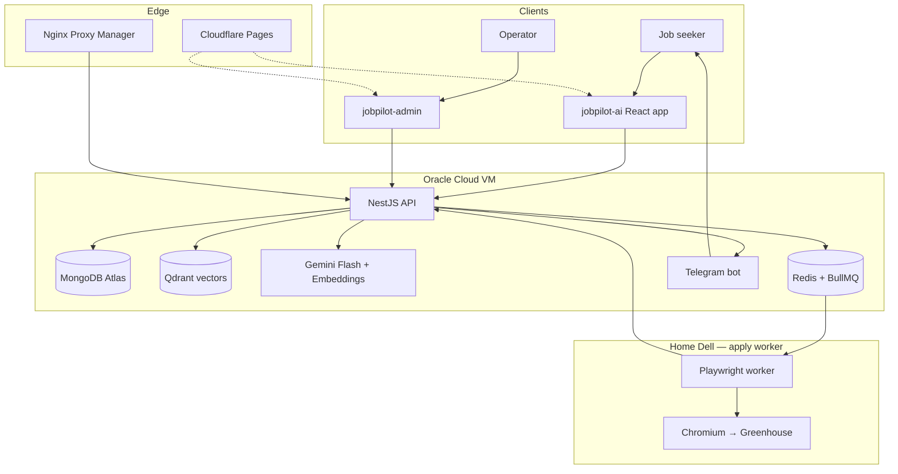
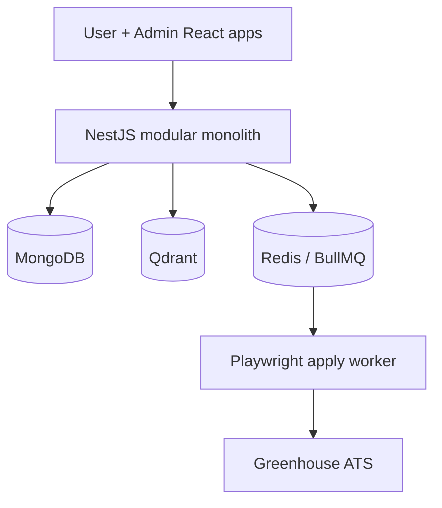
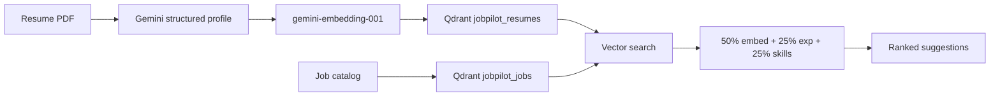
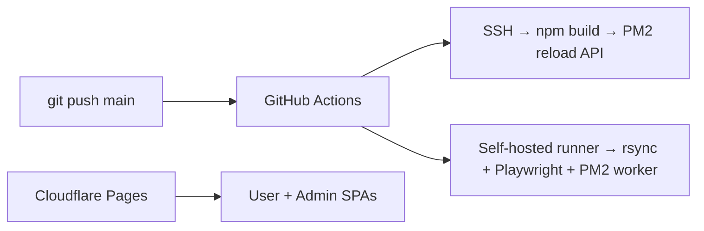

# Building JobPilot AI

Applying to jobs is repetitive work: tweak your resume, search boards, score fit, fill the same form fields, wait for email OTPs, track status. Most “AI job” tools stop at suggestions. I wanted a system that goes further — **match, enqueue, and actually drive the application** — with a human still in control.

**JobPilot AI** is that system: upload a resume, get ranked job matches, accept the ones you want, and let a browser worker fill Greenhouse applications — including Telegram-delivered security codes when the ATS emails an OTP.

---

## The problem I set out to solve

Without automation, a serious search looks like this:

- Re-read your resume for every role
- Manually scan Greenhouse / Lever / Ashby boards
- Guess fit from titles alone
- Re-type the same profile answers
- Sit on email for verification codes
- Lose track of what you already applied to

I wanted one product that owns the loop: **extract → embed → match → decide → apply → report status**.

---

## What I built

Four repositories, one product:

| Repo | Role |
| --- | --- |
| **jobpilot-ai** | User app — auth, resumes, matches, applications |
| **jobpilot-backend** | NestJS API — intelligence, queues, Telegram bot |
| **jobpilot-admin** | Internal portal — job catalog, sources, queue board |
| **jobpilot-apply-worker** | Playwright worker — fills ATS forms on a home Dell |

---

## End-to-end architecture

From signup to a submitted (or ready-to-submit) application:

**How to read it:**

1. **User app** (Cloudflare Pages) uploads a PDF and shows ranked suggestions.
2. **API** (Oracle VM) extracts the resume with Gemini, embeds it, searches jobs in Qdrant, and enqueues apply work.
3. **Redis + BullMQ** carry apply jobs to a worker that is *not* on the API host.
4. **Playwright worker** (Dell) opens the ATS page, fills the form, and asks the API’s Telegram bot when Greenhouse needs an email security code.
5. **Admin app** manages the job catalog, source sync, and queue visibility.

Control plane and browser automation are intentionally split — so a flaky ATS never takes down the API.

---

## System design choices

**Choices that matter:**

- **Modular monolith API** — resumes, jobs, auth, apply-worker, and Telegram live in Nest modules, not microservices-for-show.
- **Vector matching + heuristics** — Qdrant cosine search, then a score mix of embedding similarity, experience, and skills (not a black-box “AI score”).
- **Human gate before automation** — nothing applies until the user **Accepts** a suggestion.
- **Worker off the API host** — Chromium runs on a Dell; Redis is shared over Tailscale so the queue isn’t exposed to the public internet.
- **Three auth planes** — user JWT, admin API key, worker secret — one API, clear trust boundaries.

---

## How matching actually works

Confirming a resume writes a vector. Suggestions pull nearest jobs, then apply a transparent scoring breakdown so “why this match?” is explainable — important for trust and for debugging.

---

## Apply automation (the hard part)

Accepting a job creates an `apply_jobs` record and a BullMQ message. The Dell worker:

1. Picks the job from the `apply` queue  
2. Opens the Greenhouse (or embed) URL in Chromium  
3. Fetches applicant context + resume PDF from the API  
4. Fills the form; if fields are missing → status `needs_input` (user fixes, can retry)  
5. If email OTP appears → Telegram long-poll via the API bot → fills the code  
6. Reports `opened` / `applied` / `failed` back to Mongo  

Submit can stay off by default (`APPLY_SUBMIT=false`) so you can dry-run fills safely.

---

## Production deploy

- **API** on Oracle behind Nginx Proxy Manager + DuckDNS  
- **Worker** on a self-hosted Dell runner  
- **Frontends** on Cloudflare Pages  
- **Data** on MongoDB Atlas + Qdrant Cloud; resume PDFs on OCI Object Storage (or local disk in dev)

---

## Hard engineering problems I solved

**Cross-network job queue**  
API on Oracle, browser worker at home. Shared Redis over Tailscale so BullMQ stays private and reliable.

**Resume → structured profile**  
PDF text → Gemini with versioned prompts in Mongo → editable profile → confirm → embed. Retries and JSON repair when the model drifts.

**Explainable matching**  
Retrieval in Qdrant, then a weighted score you can reason about — not a single opaque LLM rank.

**Greenhouse reality**  
Embed URL resolution, iframe forms, missing-field discovery, OTP via Telegram, idempotent enqueue so you don’t double-apply.

**Operator safety**  
Fill-without-submit mode, `needs_input` instead of blind retries, admin queue board for stuck jobs.

**Oracle networking**  
Security lists, iptables, Docker bridge quirks, and Nginx Proxy Manager on host network so HTTPS actually reaches Nest on the right port.

---

## Tech I used

| Area | Stack |
| --- | --- |
| Frontends | React, TypeScript, Vite, TanStack Query, Zustand |
| API | NestJS, MongoDB/Mongoose, Redis, BullMQ, Qdrant |
| AI | Gemini Flash (extraction), Gemini Embeddings (768-d) |
| Automation | Playwright, Chromium, Telegram bot |
| Infra | Oracle Cloud VM, Dell self-hosted worker, Cloudflare Pages, Nginx Proxy Manager, PM2, GitHub Actions |
| Storage | MongoDB Atlas, Qdrant Cloud, OCI Object Storage |

---

## What’s in progress (honest)

JobPilot is a working core loop, not a finished SaaS checkout:

- **Stripe billing** — plans exist in the UI; real payments are not wired yet  
- **Cover letters** — on the roadmap, not in the apply path today  
- **ATS coverage** — Greenhouse apply is real; Lever/Ashby are mainly ingest today  
- **Insights / some discovery UI** — still partly mocked on the client  

The matching, enqueue, worker, and Telegram OTP path are real code in production topology.

---

## What this shows I can do

- Design a **multi-repo product** with clear ownership (UI / API / admin / worker)
- Build **AI features that ship** — extraction, embeddings, vector search — not demos
- Automate the messy web with **Playwright** and human-in-the-loop recovery
- Split **control plane vs compute** across Oracle Cloud and a home worker
- Operate **real infra**: PM2, Nginx, Tailscale Redis, CI/CD to two machines
- Keep systems **debuggable**: statuses, missing fields, dry-run submit, explainable scores

---

## What’s next

- Stripe (or similar) with real server-side plan gating  
- Cover letter generation into the apply profile  
- Broader ATS runners beyond Greenhouse  
- Scheduled board ingest instead of admin-only sync  

---

## Closing

JobPilot isn’t “ChatGPT for jobs.” It’s an **application operating system**: resume intelligence, vector matching, a decision UI, and a browser worker that does the tedious form work — with Telegram for the OTP moments ATS products still force on humans.

That’s the kind of system I like building: distributed where it must be, simple where it can be, and honest about what is production vs still on the roadmap.
