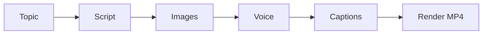
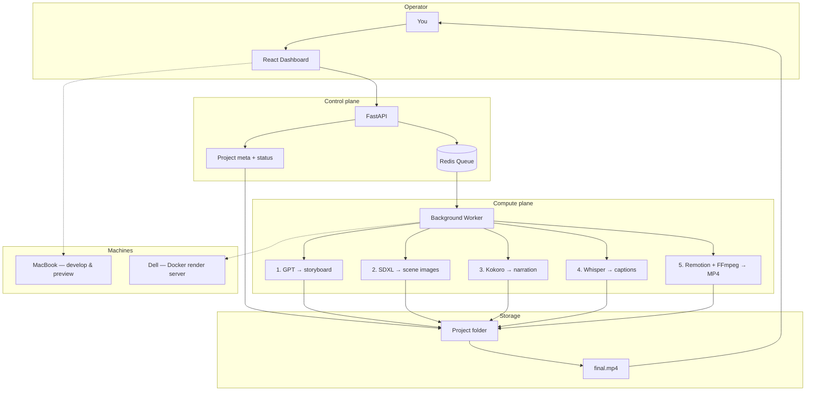
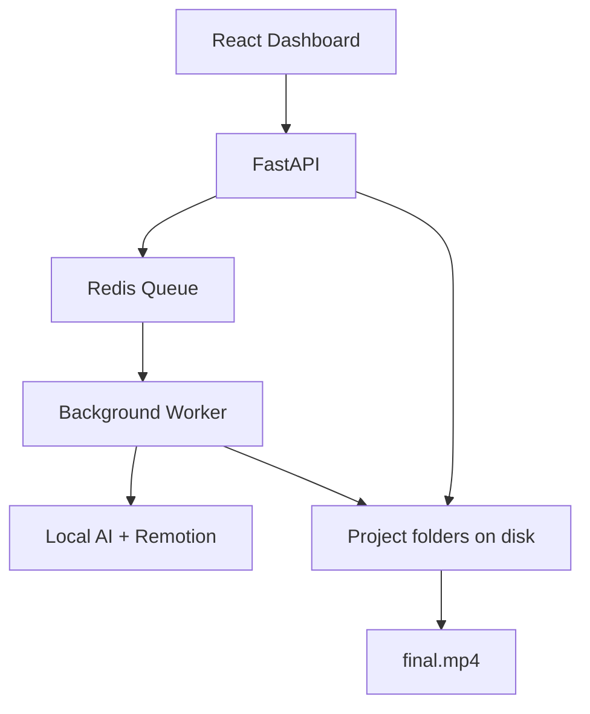
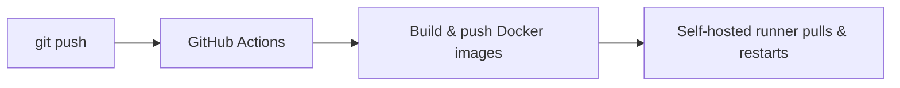

# Building a Self-Hosted AI Video Studio

Most “AI video” products are black boxes: upload a prompt, wait, pay per minute, hope the brand looks right. I wanted the opposite — a system I fully own, can debug stage by stage, and can resume when something fails.

**Local AI Video Studio** takes a single topic and produces a vertical YouTube Short (1080×1920): script, images, voice, captions, and a final MP4 — mostly on hardware I control.

---

## The problem I set out to solve

Creating educational Shorts by hand means juggling scripts, image tools, voice, captions, editors, and branding — then starting over when a render dies at 90%.

I wanted one pipeline that:

- Plans the video with AI
- Generates visuals and narration locally
- Burns in captions
- Applies consistent branding
- Can restart from the failed step, not from zero

---

## What I built

A full content pipeline with a React dashboard and a worker that runs five stages:

| Stage | What happens |
| --- | --- |
| **Script** | GPT produces a structured scene storyboard |
| **Images** | Stable Diffusion XL (local) draws each scene |
| **Voice** | Kokoro TTS narrates the script |
| **Captions** | Whisper aligns subtitles to the audio |
| **Render** | Remotion composes the Short; FFmpeg exports MP4 |

Cloud is used only where it helps most (script planning). Image, voice, captions, and render stay self-hosted.

---

## End-to-end architecture

From the moment you type a topic to the finished Short:

**How to read it:**

1. **Dashboard** — create a project, hit run, watch step status.
2. **API + queue** — accept the request, put work on Redis so the UI stays responsive.
3. **Worker** — runs each stage in order; writes results into the project folder.
4. **Disk** — storyboard, PNGs, WAV, captions, and MP4 are real files you can open or re-run from.
5. **Two machines** — build on Mac; heavy rendering on the Dell via Docker.

That’s the whole system: UI → API → queue → worker → local AI → files → Short.

---

## System design choices

**Design choices that matter:**

- **Filesystem as the database** — each project is a folder of artifacts (`storyboard.json`, images, audio, captions, `final.mp4`). Easy to inspect and resume.
- **Queue-driven workers** — long AI jobs never block the UI; Redis/RQ runs them in the background.
- **Same scripts on Mac and Dell** — develop on a laptop, render on a self-hosted server via Docker.
- **Brand + theme packs** — prompts, voice defaults, and watermark/intro/outro assets stay consistent across videos.

---

## Production deploy

This isn’t only a local demo. The stack ships to a Dell machine automatically:

React UI behind nginx, API + worker containers, Redis, model weights and projects on persistent volumes.

---

## Hard engineering problems I solved

**Resumable pipeline**  
If captions fail, images and voice stay on disk. Re-run from that step instead of regenerating everything.

**Status honesty**  
Workers can crash and leave jobs stuck on “running.” A reconcile pass detects dead jobs and fixes project status so the dashboard tells the truth.

**Prompt layering**  
Defaults → brand → theme pack → optional project overrides, with placeholders like topic and brand name — without duplicating configs.

**Hardware realism**  
On a CPU Dell, image settings are tuned for SDXL-Turbo (smaller frames, few steps) then cropped to Shorts resolution. Mac can use Apple Silicon paths for Whisper. Same product, different machine profiles.

**Operator controls**  
Stop a run and keep partial work, or wipe and restart. Preview a voice before generating a full narration. Edit brand prompts from the UI.

---

## Tech I used

| Area | Stack |
| --- | --- |
| Frontend | React, TypeScript, Vite |
| Backend | FastAPI, Redis, RQ workers |
| AI | OpenAI (scripts), Diffusers SDXL-Turbo, Kokoro TTS, Whisper |
| Video | Remotion, FFmpeg |
| Ops | Docker Compose, GitHub Actions, GHCR, self-hosted runner |

---

## Outcomes — what I achieved

- Shipped an **end-to-end AI video system** — topic in, branded YouTube Short out — not a single model demo
- Separated **orchestration** (API + Redis queue) from **compute** (workers + stage scripts) so the UI stays responsive under long jobs
- Built a **local-first AI pipeline** (SDXL, Kokoro, Whisper, Remotion) with cloud used only for script planning — lower cost and more control
- Replaced manual editing with **programmatic Remotion renders** (1080×1920 Shorts + captions + brand bookends)
- Shipped **production DevOps**: Docker Compose, GHCR images, GitHub Actions, and auto-deploy to a self-hosted Dell runner
- Made failures recoverable: **resume from any stage**, status reconcile, stop keep/wipe, and inspectable artifacts on disk

---

## What’s next

- Stronger multi-brand switching in the UI
- GPU workers for faster image generation
- Post-render steps (thumbnails, YouTube draft upload)
- Curriculum sequencing — next lesson based on what already shipped

---

## Closing

The goal wasn’t another AI demo. It was a **small media operating system**: plan → generate → narrate → caption → render → deploy — with stages you can see, stop, and restart.

That’s the kind of system I like building: clear boundaries, honest status, and automation that still leaves the operator in control.
